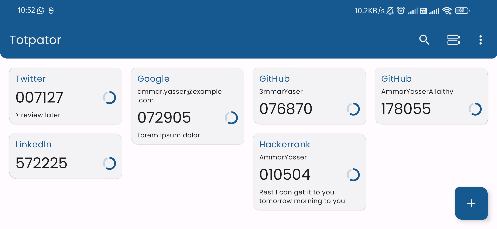
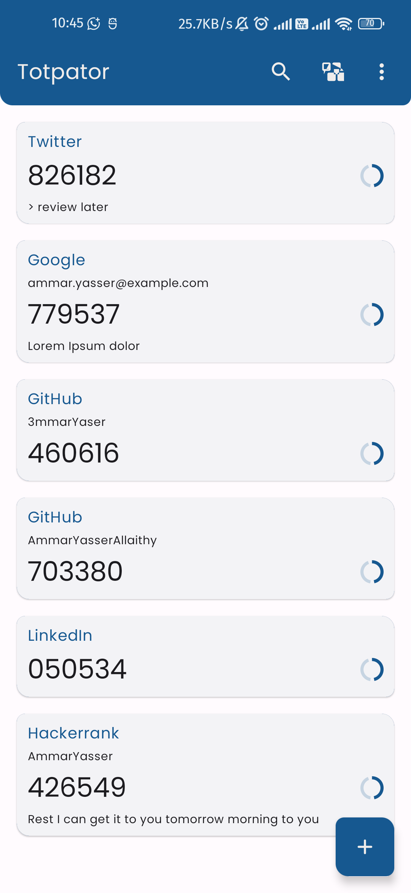
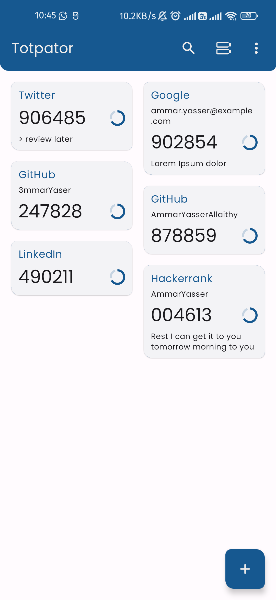
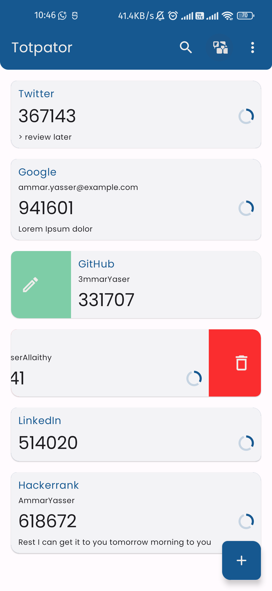
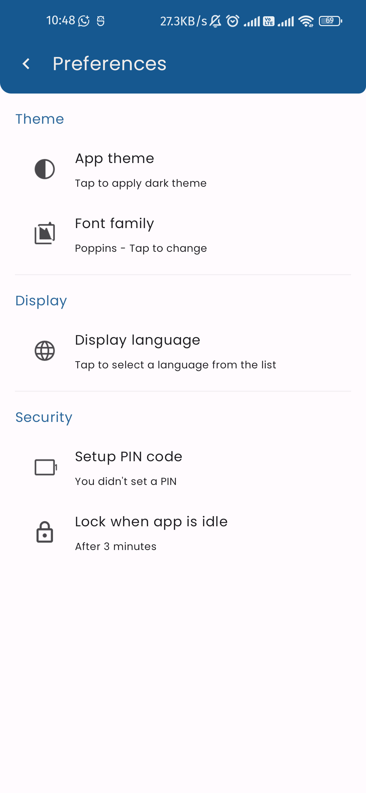

# Totpator

Promote security of your accounts by this two-factor authentication android jetpack compose app that generates time-based one time passwords based on your shared secret key.

- Kotlin
- Jetpack
    - Compose
    - Navigation
    - Room
- MVVM architecture
- Preferences Datastore

## Screenshots

**Landscape**

**Portrait**

 

